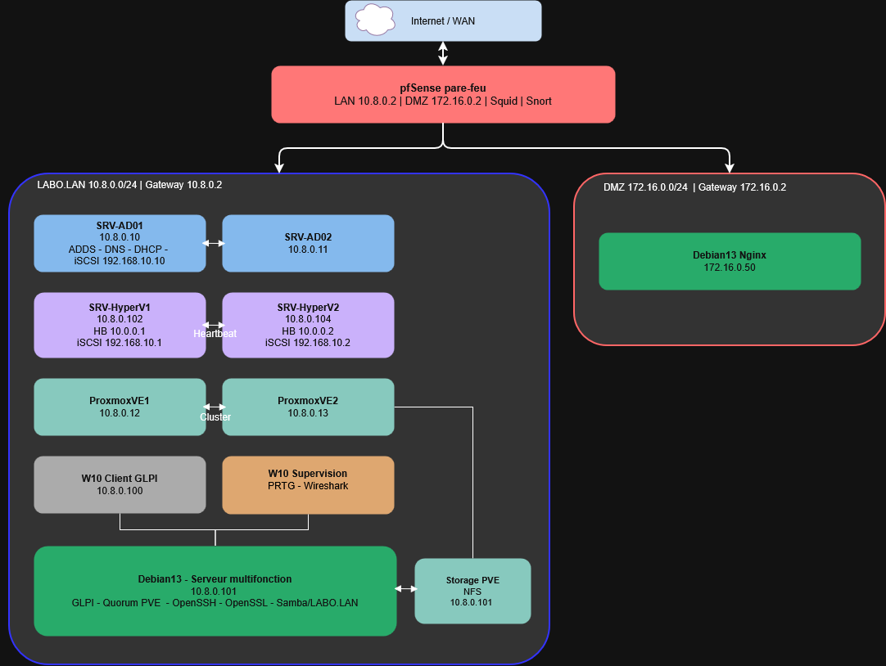

# 🛠️ Laboratoire Virtuel - Infrastructure Système et Réseau (labo.lan)

Ce dépôt rassemble l'ensemble de la documentation technique, des architectures et des configurations de mon environnement de laboratoire, réalisé dans le cadre de ma formation de **Technicien Supérieur Systèmes et Réseaux (TSSR)**.

---

## Présentation du Projet
L'objectif de ce laboratoire est de concevoir, déployer, cloisonner et sécuriser une infrastructure réseau complète simulant l'environnement de production d'une entreprise, articulée autour d'un pare-feu central, d'un LAN d'administration/production et d'une DMZ. Le projet va continuer d'évoluer avec le temps !

---

## Architecture Réseau & Schéma cible
Voici le schéma conceptuel de l'infrastructure (zones de routage, adressage et cloisonnement) :

---

## Plan d'Adressage détaillé de l'Infrastructure

### Zone Pare-feu / WAN
* **Internet / WAN** 
* **pfSense Pare-feu :** 
  * Interface LAN : `10.8.0.2` | Interface DMZ : `172.16.0.2`[ci
  * Services de sécurité activés : **Squid** (Proxy) & **Snort** (IDS/IPS)

### Zone LAN : LABO.LAN (`10.8.0.0/24` | Passerelle : `10.8.0.2`)
* **Contrôleurs de Domaine (Active Directory) :**
  * `SRV-AD01` (`10.8.0.10`) : Rôles ADDS - DNS - DHCP | Liaison iSCSI via `192.168.10.10`
  * `SRV-AD02` (`10.8.0.11`) : Contrôleur secondaire répliqué[cite: 1]
* **Cluster de Virtualisation Microsoft Hyper-V :**
  * `SRV-HyperV1` (`10.8.0.102`) | Heartbeat : `10.0.0.1` | Réseau iSCSI : `192.168.10.1`
  * `SRV-HyperV2` (`10.8.0.104`) | Heartbeat : `10.0.0.2` | Réseau iSCSI : `192.168.10.2`
* **Cluster de Virtualisation Open-Source Proxmox VE :**
  * `ProxmoxVE1` (`10.8.0.12`)
  * `ProxmoxVE2` (`10.8.0.13`)
  * **Storage PVE :** Serveur de stockage dédié (NFS) sur l'IP `10.8.0.101`
* **Gestion, Supervision & Clients :**
  * `Debian13 (Serveur Multifonction)` (`10.8.0.101`) : Héberge l'inventaire/parc informatique **GLPI**, sert de **Quorum PVE** pour le cluster Proxmox, et embarque OpenSSH, OpenSSL, ainsi qu'un partage Samba.
  * `W10 Client GLPI` (`10.8.0.100`) : Poste de travail utilisateur.
  * `W10 Supervision` (`10.8.0.x`) : Console d'administration réseau équipée de **PRTG** et **Wireshark**.

### Zone DMZ (`172.16.0.0/24` | Passerelle : `172.16.0.2`)
* **Serveur Web Externe :**
  * `Debian13 Nginx` (`172.16.0.50`) : Serveur web isolé de la production pour accueillir les flux externes HTTP/HTTPS.
